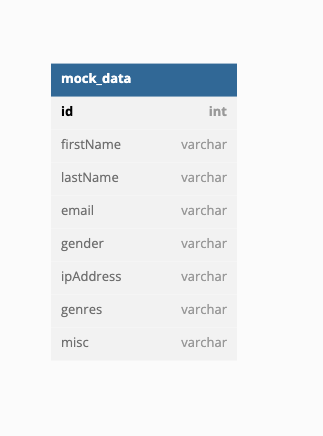
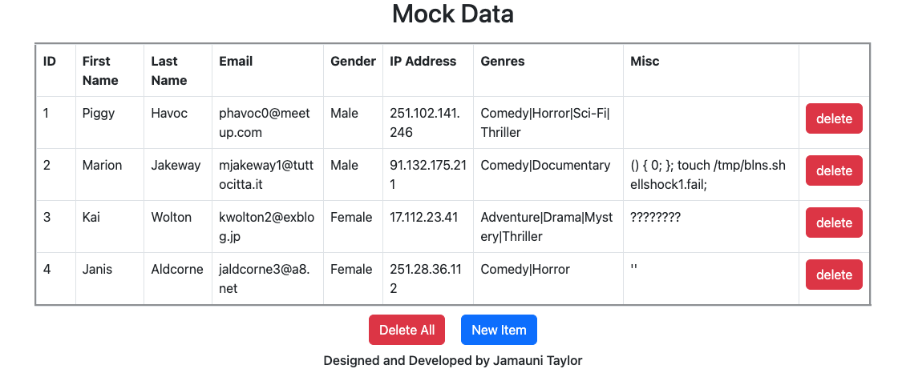

# Data Processing Microservice
A microservice/webhook to process and return data using codeigniter v3.1.11

For this project, I was tasked with creating a microservice using codeigniter and bootstrap on a LAMP(Linux, Apache2, MySQL, and PHP stack).

## Task Breakdown
The task was broken down into 4 segments:
	
[Task A: Design a MySQL / MariaDB solution to store the data, provide the SQL insert statement for creation.](#task-a)

[Task B: Design a controller to process the data from a POST statement from 4.5.6.0/24 and insert it into the database.](#task-b) 
	
[Task C: Design a controller to return json data for *.budgetvm.com or 6.5.4.0/24 with options to filter and limit the return based on any variable.](#task-c)
	
[Task D: Create a CRUD interface in bootstrap to manage the database solution (Ajax/jQuery optional).](#task-d)

### Task A:
For Task A, I started by charting the design for my table schema. 




This schema was designed based on the expected post data like the one below:
```json
{"id":1,"first_name":"Piggy","last_name":"Havoc","email":"phavoc0@meetup.com","gender":"Male","ip_address":"251.102.141.246","genres":"Comedy|Horror|Sci-Fi|Thriller","misc":"᠎"},
{"id":2,"first_name":"Marion","last_name":"Jakeway","email":"mjakeway1@tuttocitta.it","gender":"Male","ip_address":"91.132.175.211","genres":"Comedy|Documentary","misc":"() { 0; }; touch /tmp/blns.shellshock1.fail;"},
{"id":3,"first_name":"Kai","last_name":"Wolton","email":"kwolton2@exblog.jp","gender":"Female","ip_address":"17.112.23.41","genres":"Adventure|Drama|Mystery|Thriller","misc":"👩🏽"},
{"id":4,"first_name":"Janis","last_name":"Aldcorne","email":"jaldcorne3@a8.net","gender":"Female","ip_address":"251.28.36.112","genres":"Comedy|Horror","misc":"''"},
{"id":5,"first_name":"Drusie","last_name":"Melato","email":"dmelato4@apple.com","gender":"Female","ip_address":"116.219.239.177","genres":"Romance","misc":"̡͓̞ͅI̗̘̦͝n͇͇͙v̮̫ok̲̫̙͈i̖͙̭̹̠̞n̡̻̮̣̺g̲͈͙̭͙̬͎ ̰t͔̦h̞̲e̢̤ ͍̬̲͖f̴̘͕̣è͖ẹ̥̩l͖͔͚i͓͚̦͠n͖͍̗͓̳̮g͍ ̨o͚̪͡f̘̣̬ ̖̘͖̟͙̮c҉͔̫͖͓͇͖ͅh̵̤̣͚͔á̗̼͕ͅo̼̣̥s̱͈̺̖̦̻͢.̛̖̞̠̫̰"},
{"id":6,"first_name":"Belia","last_name":"Nan Carrow","email":"bnancarrow5@businessinsider.com","gender":"Female","ip_address":"108.212.52.73","genres":"Drama|Mystery","misc":"社會科學院語學研究所"},
{"id":7,"first_name":"Gabrila","last_name":"Portman","email":"gportman6@geocities.jp","gender":"Female","ip_address":"70.121.181.84","genres":"Drama|Romance","misc":"울란바토르"},
{"id":8,"first_name":"Birch","last_name":"Tremlett","email":"btremlett7@eventbrite.com","gender":"Male","ip_address":"84.7.162.62","genres":"Action|Comedy|Musical","misc":"ثم نفس سقطت وبالتحديد،, جزيرتي باستخدام أن دنو. إذ هنا؟ الستار وتنصيب كان. أهّل ايطاليا، بريطانيا-فرنسا قد أخذ. سليمان، إتفاقية بين ما, يذكر الحدود أي بعد, معاملة بولندا، الإطلاق عل إيو."},
{"id":9,"first_name":"Lotty","last_name":"Oneal","email":"loneal8@zimbio.com","gender":"Female","ip_address":"208.248.132.43","genres":"Horror|Sci-Fi","misc":"(╯°□°）╯︵ ┻━┻)  "},
{"id":10,"first_name":"Norine","last_name":"Korneichuk","email":"nkorneichuk9@ox.ac.uk","gender":"Female","ip_address":"105.193.162.119","genres":"Action|Adventure|Drama","misc":"../../../../../../../../../../../etc/hosts"},
{"id":11,"first_name":"Marigold","last_name":"Pomfrey","email":"mpomfreya@com.com","gender":"Female","ip_address":"110.133.213.147","genres":"Comedy|Romance","misc":"Z̮̞̠͙͔ͅḀ̗̞͈̻̗Ḷ͙͎̯̹̞͓G̻O̭̗̮"}]
```
To see all of sample data [click here](./Task/MOCK_DATA.json).

After designing and constructing my table schema/db, I completely jumped the gun and started writing procedures for my php scripts to trigger. But I realized shortly after creating the procedures that CodeIgniter comes built with query tools.

Nevertheless, here is a sample of the procedures I created.

```sql
# procedure for inserting new rows into table
USE `budgetvm` $$
CREATE procedure `InsertNewRow` (IN newID INT, IN newFirstName VARCHAR(120), IN newLastName VARCHAR(120), IN newEmail VARCHAR(120), IN newGender VARCHAR(120), IN newIpAddress VARCHAR(120), IN newGenre VARCHAR(120), IN newMisc VARCHAR(120))
BEGIN
	INSERT INTO `budgetvm`.`mock_data` (`id`, `firstName`, `lastName`, `email`, `gender`, `ipAddress`, `genres`, `misc`)
    VALUES (newID, newFirstName, newLastName, newEmail, newGender, NewIpAddress, newGenre, newMisc);
END $$
```
If you are interested in seeing my scripts for creating procedures [click here](./Task/queries.sql).

Alternatively, I used the following function in my DataModel for retrieving data from the mock data table.
```php
// retrieves all items from the mock_data table
public function get_data($id = FALSE) {
	# if id === false 
	if($id === FALSE)
	{
		# get all items from the mock data table 
		$query = $this->db->get('mock_data');
		
		# return query results 
		return $query->result_array();
	}
	
	# get all data from mock data table === passed id
	$query = $this->db->get_where('mock_data', array("id" => $id));
	
	# return query results
	return $query->row_array();
}
```
The get_data function functions based on the presence of the id parameter. If the id parameter is present, the function pulls all rows from the mock data table with matching ids. If the id parameter is not present, the function pulls all data from the mock data table.

If you are interested in seeing the entire data model [click here](./application/models/DataModel.php).

### Task B: 
For task B, I designed a controller that would process data from a POST statement from 4.5.6.0/24 and insert that processed data into the mock_data table.
```php
# post data class for updating/replacing data in mock data table  
class PostData extends CI_Controller {
	# constructor
	public function __construct() {
		parent::__construct();
		# load data model 
		$this->load->model('dataModel');
		# load url helper
		$this->load->helper('url_helper');
	}
	
	# index function for request without parameters
	public function index()
	{ 
		# parse post data, then store results 
		$post_data["raw_json"] = json_decode(file_get_contents("php://input"));
		# update/replace data with post data, store results 
		$data['results'] = $this->dataModel->replace_data($post_data);
		# present results via response
		echo json_encode($data);
	}
}
```

For this controller, I only used the index function since I did intend on passing parameters to it. The index function simple retrieves the post data and attempts replace the corresponding rows in the mock data table.

In order to only allow connections from 4.5.6.0/24, I modified my apache site configuration to only allow access from 4.5.6.0/24 and to deny access to all other connections.
```configuration
<Location /index.php/postData>
	Deny from all
	Allow from 4.5.6.0/24
</Location>
```

### Task C: 
For task C, I designed a controller that would present all a json of data from the mock data table along with a function for handling passed parameters. 
```php
# mock data class for viewing entire data set 
class MockData extends CI_Controller {
	# constructor
	public function __construct() {
		parent::__construct();
		# load data model 
		$this->load->model('dataModel');
		# load url helper
		$this->load->helper('url_helper');
	}
	
	# index function for request without parameters
	public function index()
	{
		# store mock data into data object
		$data['dataModel'] = $this->dataModel->get_data();
		# store title into data object
		$data['title'] = 'Mock Data';
		# load view for mock data while passing data to view
		$this->load->view('mockData/index', $data);
	}
	
	# view function for request with parameters
	public function view($var = NULL, $var2 = NULL, $var3 = 0)
	{
		# get data based on passed parameters
		# store results into data object 
		$data['data_item'] = $this->dataModel->get_data_like($var, $var2, $var3);
		
		# if data is not in data object 
		if(empty($data['data_item'])) 
		{ 
			# get all data from mock data table 
			# store results into data object
			$data['data_item'] = $this->dataModel->get_data();  
		}
		
		# stringify and present data via response
		echo json_encode($data['data_item']);
	}
}
```
In the event that parameters are passed, the controller attempts to trigger the "get_data_like" function from the dataModel. The get_data_like function queries the mock table and operates as a filter. In the event that the parameters fail, the controller attempts to retrieve all of the information from the mock data table.

```php
# retrieves all items from the mock_data table like column name using data
# limit results by limit parameter 
public function get_data_like($columnName = NULL, $data = NULL, $limit = 0) {
	# if columnName and $data not set 
	if ($columnName === NULL || $data === NULL ) {
		# get all mock data 
		$query = $this->db->get('mock_data');
		# return results 
		return $query->result_array();
	}
	
	# form SQL query with parameters
	$this->db->select('*');
	$this->db->from('mock_data');
	$this->db->like($columnName, $data, 'both');
	$this->db->limit($limit);
	$query = $this->db->get();
	
	# return query results 
	return $query->result_array();
} 
```
In order to allow request from 6.5.4.0 for *.budgetvm.com, I modified my apache site configuration again:
```configuration
ServerAlias *.budgetvm.com
...
<Location ~ "/index.php/mockData/.*">
	Deny from all
	Allow from 6.5.4.0/24
</Location>
```

The results of request from the url "http://www.budgetvm.com/index.php/mockData/gender/Male/3" returns all rows where their gender column has like text for "Male" and limits the number of rows returned to 3.
```json
[{"id":"1","firstName":"Piggy","lastName":"Havoc","email":"phavoc0@meetup.com","gender":"Male","ipAddress":"251.102.141.246","genres":"Comedy|Horror|Sci-Fi|Thriller","misc":"\u180e"},{"id":"2","firstName":"Marion","lastName":"Jakeway","email":"mjakeway1@tuttocitta.it","gender":"Male","ipAddress":"91.132.175.211","genres":"Comedy|Documentary","misc":"() { 0; }; touch \/tmp\/blns.shellshock1.fail;"},{"id":"3","firstName":"Kai","lastName":"Wolton","email":"kwolton2@exblog.jp","gender":"Female","ipAddress":"17.112.23.41","genres":"Adventure|Drama|Mystery|Thriller","misc":"????????"}]
```

### Task D: 
Create a CRUD interface in bootstrap to manage the database solution (Ajax/jQuery optional)

For task D, I designed a crud interface using Bootstrap to view mock data, a controller for inserting/creating data in mock data table, a controller for deleting data from mock data table, and custom [Ajax/js scripts](./js/mockdata.js) to update the elements asynchronously.



The UI allows users to delete items from specific rows, delete all items, add new items, and to edit the items in the table on the fly. 

When the user starts editing the items in the table, javaScript is executed to update the rows in the mock data table via the PostData controller.

When the user clicks any of the delete buttons, the DeleteData controller either deletes all data from the mock data table or deletes a row based on a passed id.

```php
# delete data controller for deleting from mock data table
class DeleteData extends CI_Controller {
	# constructor
	public function __construct() {
		parent::__construct();
		# load data model 
		$this->load->model('dataModel');
		# load url helper
		$this->load->helper('url_helper');
	}
	
	# index function for request without parameters
	public function index() {
		# set results == 200;
		$data["results"] = "200";
		# delete all data from mock_data table 
		$this->dataModel->delete_all_data();
		# present results via response
		echo json_encode($data);
	}
	
	# view function for deleting specific row by pass ID
	public function view($nID = NULL) {
		# initialize results to 200
		$data['results'] = 200;
		
		# if new ID === NULL
		if($nID === NULL) {
			# set results code to 500
			$data['results'] = 500;
		} else {
			# delete data/row by ID, store results 
			$results["results"] = $this->dataModel->delete_data($nID);
		}
		
		#present results via response
		echo json_encode($results);
	}
}
```

## URL Index
	http://www.budgetvm.com/index.php/insertData : Insert Data via POST
	http://www.budgetvm.com/index.php/deleteData : Delete All Data 
	http://www.budgetvm.com/index.php/deleteData/[id] : Delete All Rows that match id
	http://www.budgetvm.com/index.php/postData : Update/Replace via POST
	http://www.budgetvm.com/index.php/mockData/[variable/columnName]/[data] : filtered json without limit
	http://www.budgetvm.com/index.php/mockData/[variable/columnName]/[data]/[limit] : filtered json with limit
	http://www.budgetvm.com/index.php/mockData : Crud Interface
	
## routes
```configuration
$route['insertData'] = 'insertData';
$route['deleteData/(:any)'] = 'deleteData/view/$1';
$route['deleteData'] = 'deleteData';
$route['postData/(:any)'] = 'postData/view/$1';
$route['postData'] = 'postData';
$route['mockData/(:any)/(:any)'] = 'mockData/view/$1/$2';
$route['mockData/(:any)/(:any)/(:num)'] = 'mockData/view/$1/$2/$3';
$route['mockData'] = 'mockData';
$route['(:any)'] = 'pages/view/$1';
$route['default_controller'] = 'pages/view';
```

### Thanks
I really appreciate you making it this far!
